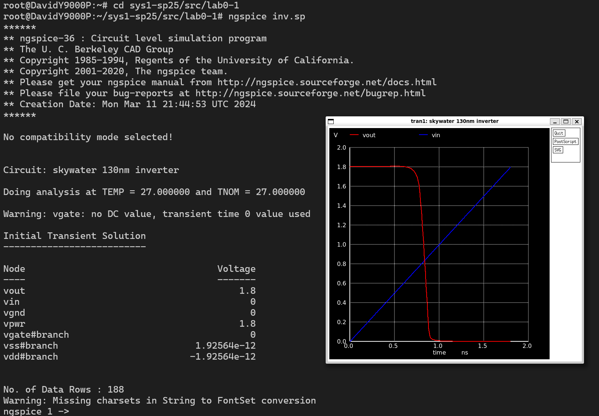
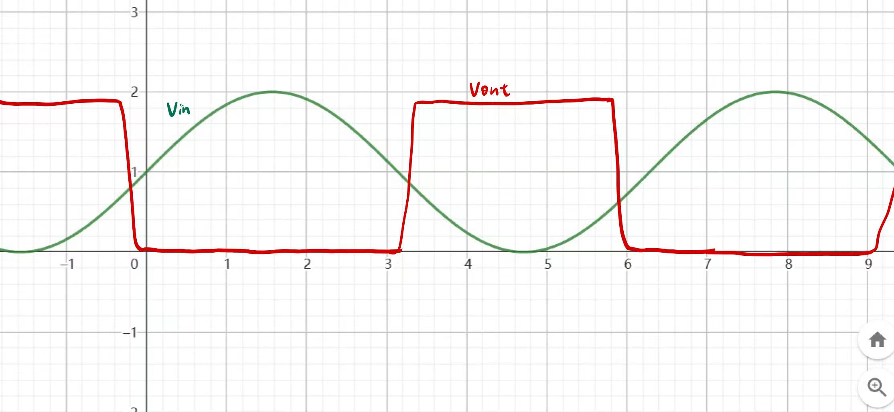
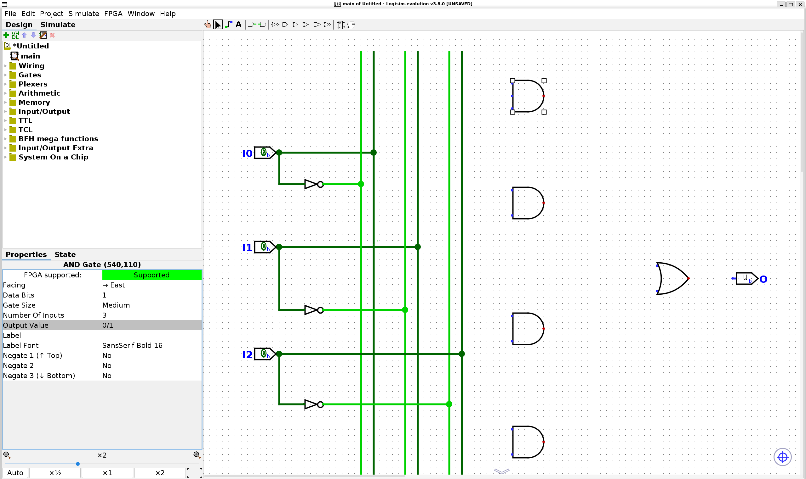
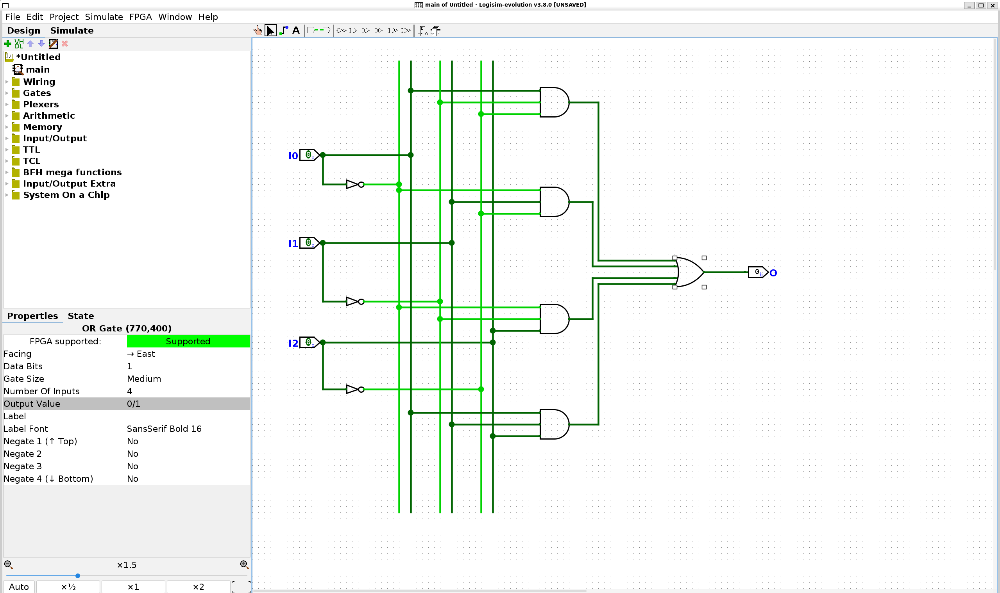

# Lab0-1 实验报告

## 1. 实验目的
本次实验可以让我们对 Linux 环境中各种软件的基本操作有了一定理解，也让我接触到了最基础的电路设计软件。

## 2. 反相器的电压传输特性

### 2.1 相关步骤展示

这是在 WSL Bash 中输入了 `ngspice inv.sp` 之后展示的画面。

### 2.2 输入输出关系
在 V_in 暂时较小的时候，V_out 会一直维持在一个比较高的电平上，且这一稳定的高电平应该为 1.8V。

在 V_in 高于 0.6V 这个阈值的时候，V_out 对 V_in 的变化会非常明显，在这一区间内会迅速下降到 0。

在 V_in 大于 1.0V 的时候，V_out 会维持在稳定的低电平上。

### 2.3 如果输入是正弦电压，预测的输出

稳定的高电平应该为 1.8V。

红色是 V_out，绿色是 V_in。

首先是触发改变的输入电压应该是在 0.6V 左右，所以在画图时应该在 V_in = 0.6V 的时候发生跳变。

跳变的时间很短，反映到图像上就是输出电压曲线在跳变的时候会很陡峭。

### 2.4 阈值设定

#### 输入阈值设定
根据反相器的图像，我们注意到在 V_in > 0.6V 的时候就会出现 V_out 骤降，所以可以认为输入 0 阈值应该为 0.6V。

注意到当 V_in > 1V 时，V_out 就保持在一个一直都比较低的水平上，所以可以认为输入 1 阈值应该为 1.0V。

#### 输出阈值设定
根据反相器的输入输出图像，应该有输出必须要处于输入的阈值之内。

观察图像，应该有输出 0 阈值应该为 0.05V 左右，在此之后电压差距不会太大。

输出 1 阈值应该为 1.75V 左右，在此之后电压一直维持在稳定的高电平。

## 3. Logisim 电路仿真

### 3.1 实验截图

通过属性设定将原本的二输入与门改成三输入与门。

连线完成之后的调试阶段。

### 3.2 输入输出对应表

| Input |       |       | Output |
|-------|-------|-------|--------|
| I0    | I1    | I2    | O      |
| 0     | 0     | 0     | 0      |
| 0     | 0     | 1     | 1      |
| 0     | 1     | 0     | 1      |
| 0     | 1     | 1     | 0      |
| 1     | 0     | 0     | 1      |
| 1     | 0     | 1     | 0      |
| 1     | 1     | 0     | 0      |
| 1     | 1     | 1     | 1      |

### 3.3 逻辑关系分析
输出前的最后一个门是或门，说明分析针对的是一种存在性问题。

接下来分别分析四个与门，分析这四个与门输出 1 的条件是什么。

第一、二、三都是两个为 0 一个为 1 时触发（已经遍历了全部两个 0 一个 1 的情况）。

第四个与门是三个都为 1 的时候会触发。

所以我们得出最终的结论，也就是输出的信号就是“是否有偶数个 0（奇数个 1）”。

## 4. 心得体会
这是我第一次接触与电路设计相关的软件使用，也是第一次开始使用 Linux 环境以及环境中的各种软件，对我而言是很新奇的体验，希望之后能够接触到更多这样的机会。