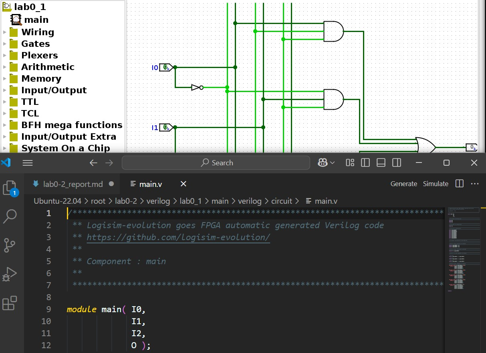
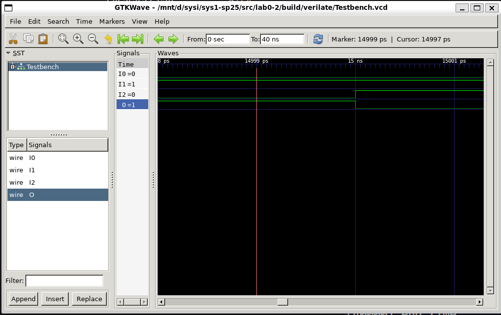
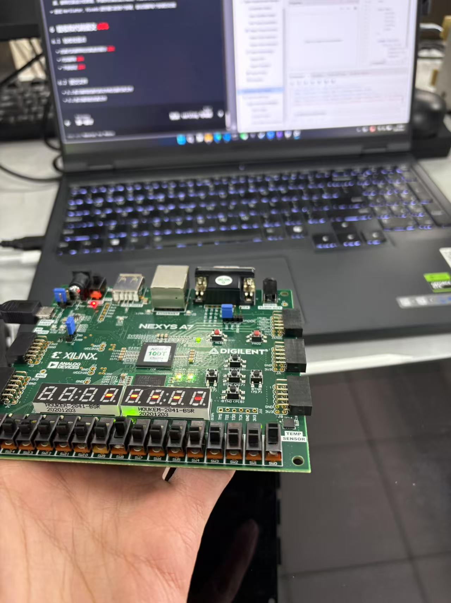
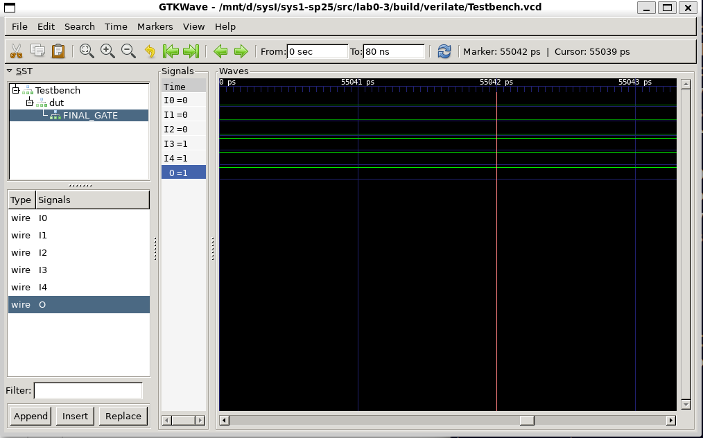
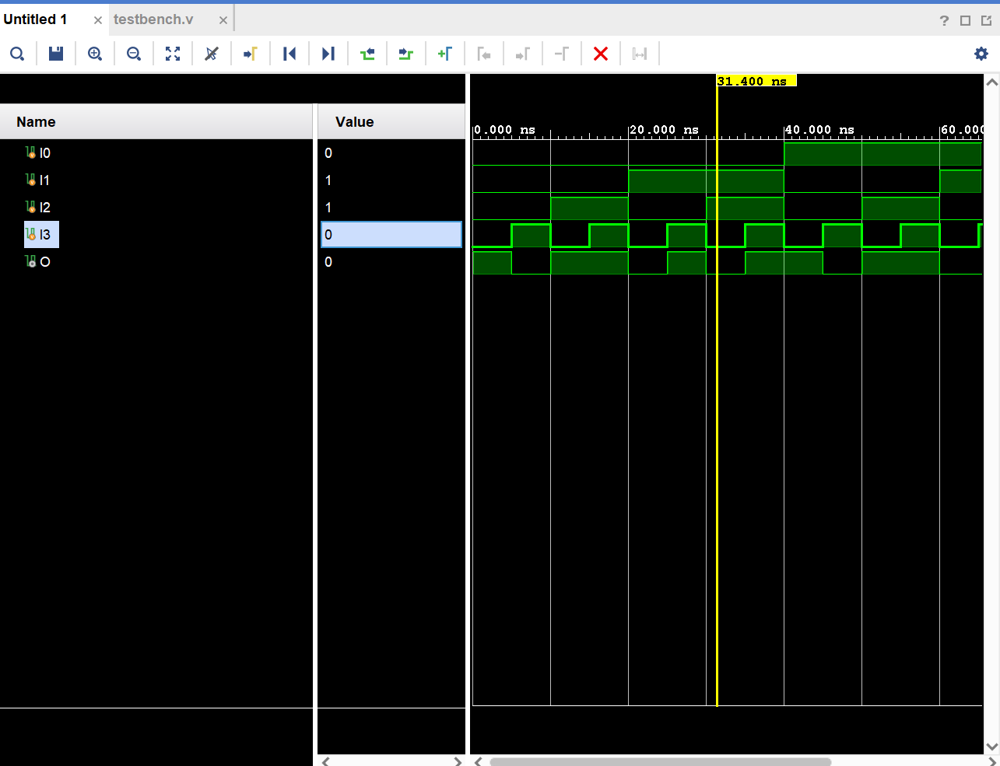

# Lab0-2 实验报告

## 1. 实验目的
- 对`verilog`编程有一个初步的了解，对`v`语法有初步的认知
- 了解`verilog`的文件结构与不同文件的不同功能
- 学会使用Verilator与Vivado仿真验证电路可行性
- 学会在Vivado上导入各种文件以构建一个完整的电路，随后通过各个步骤产生比特流并下载到开发板中

## 2. 实验过程
### 2.1. 将原理图导出为verilog
- 我们在logisim中是在GUI下对电路进行编辑的，如果我们选择下载，则可以生成一个相对应的verilog文件`main.v`.

- 在截屏中我们可以观察到输入输出端口在verilog文件中的名字与logisim中是相同的。
- 同时注意到在GATES文件夹中还有与或门的实现，这与C语言的**多文件编程**有一定的相似之处。
### 2.2. Verilator仿真测试
- 仿真的意思就是**让计算机模拟逻辑电路的运行**，然后就可以检查输入输出是否是正确的。
- **激励**这个概念让我觉得很困惑，于是在后来查询之后认识到激励的意思就是**为设计模块提供输入条件或者测试条件**，所以仿真激励文件的作用就是**提供激励**，这个激励信号在我们的实现中是与时间相关的。
- 在我们的文件当中testbench.v就是仿真激励文件，我们可以利用Verilator或者Vivado产生仿真的波形来验证电路的正确性。

- 这里就是Verilator中对我们电路的仿真结果，我们可以拖动时间进度条来查看不同时间下的不同输入对应的不同输出结果。
### 2.3. Vivado下板工作流程
- Add Sources的时候要把main.v, gates.v与top.v全部作为sources导入。这些文件如同C语言当中的不同.c文件一样，会把一些在其他文件中用到的module在不同的文件中进行实现。比如说在这里top.v就是顶层模块，类似于c语言中的main函数，调用main.v中的具体电路实现，而在top.v只要实例化main再分配输入输出即可。
- **综合**就是把电路先抽象化再转化为与FPGA相关的电路，而**构建**是把连线与资源映射到FPGA真实元器件上的过程。
- 在vivado中可以实现与Verilator中相同的仿真过程，可以通过拖动进度条来实现对输出的观察。
## 3. 实验结果
### 3.1. Verilog练习 结果
- 逻辑表达
    - 该电路能够正确表达逻辑
    - 关于不同文件的职责：main.v负责**实现具体电路细节**，top.v负责将main模块的电路实现**与FPGA的实际引脚SW等等相连接**，xdc文件是用来指定FPGA板上的物理引脚与Verilog端口的连接的。
    
    - 上图是烧录后的实验过程，通过**拨动SW0-SW3**，观察**H17端口的LED情况来**验证得该逻辑关系是正确的。
- 实验结果

| SW0 (A) | SW1 (B) | SW2 (C) | SW3 (D) | LED (F) |
|---------|---------|---------|---------|---------|
|    0    |    0    |    0    |    0    |    1    |  
|    0    |    0    |    0    |    1    |    0    |
|    0    |    0    |    1    |    0    |    1    |  
|    0    |    0    |    1    |    1    |    1    |  
|    0    |    1    |    0    |    0    |    0    |
|    0    |    1    |    0    |    1    |    1    |  
|    0    |    1    |    1    |    0    |    0    |
|    0    |    1    |    1    |    1    |    1    |  
|    1    |    0    |    0    |    0    |    1    |  
|    1    |    0    |    0    |    1    |    0    |
|    1    |    0    |    1    |    0    |    1    |  
|    1    |    0    |    1    |    1    |    1    | 
|    1    |    1    |    0    |    0    |    0    |
|    1    |    1    |    0    |    1    |    0    |
|    1    |    1    |    1    |    0    |    1    |  
|    1    |    1    |    1    |    1    |    1    | 

### 3.2. 仿真练习 结果
- 仿真设计的思路：
    - 应该要遍历全部的可能输入组合，再观察得到没每一种输入组合所对应的输出。
    - 我采用了二进制顺序进行输入组合遍历，也就是从0000到1111依据二进制加一进行遍历
    - 这样的思路在`testbench.v`当中的体现是
```v
    initial begin
        I0 = 1'b0; I1 = 1'b0; I2 = 1'b0; I3 = 1'b0;
        #5;
        I0 = 1'b0; I1 = 1'b0; I2 = 1'b0; I3 = 1'b1;
        #5;
        I0 = 1'b0; I1 = 1'b0; I2 = 1'b1; I3 = 1'b0;
        #5;
        I0 = 1'b0; I1 = 1'b0; I2 = 1'b1; I3 = 1'b1;
        #5;
        I0 = 1'b0; I1 = 1'b1; I2 = 1'b0; I3 = 1'b0;
        #5;
        I0 = 1'b0; I1 = 1'b1; I2 = 1'b0; I3 = 1'b1;
        #5;
        I0 = 1'b0; I1 = 1'b1; I2 = 1'b1; I3 = 1'b0;
        #5;
        I0 = 1'b0; I1 = 1'b1; I2 = 1'b1; I3 = 1'b1;
        #5;
        I0 = 1'b1; I1 = 1'b0; I2 = 1'b0; I3 = 1'b0;
        #5;
        I0 = 1'b1; I1 = 1'b0; I2 = 1'b0; I3 = 1'b1;
        #5;
        I0 = 1'b1; I1 = 1'b0; I2 = 1'b1; I3 = 1'b0;
        #5;
        I0 = 1'b1; I1 = 1'b0; I2 = 1'b1; I3 = 1'b1;
        #5;
        I0 = 1'b1; I1 = 1'b1; I2 = 1'b0; I3 = 1'b0;
        #5;
        I0 = 1'b1; I1 = 1'b1; I2 = 1'b0; I3 = 1'b1;
        #5;
        I0 = 1'b1; I1 = 1'b1; I2 = 1'b1; I3 = 1'b0;
        #5;
        I0 = 1'b1; I1 = 1'b1; I2 = 1'b1; I3 = 1'b1;
        #5;
        $finish;
    end
```
- 仿真结果验证
    - Verilator仿真：
    
    - Vivado仿真：
    
    - 由检验可得这里的逻辑电路设计是正确的。

## 4. 实验心得
- 在解决具体的问题之前一定要先对整体有一定了解。例如我刚开始对文件结构并不了解，所以很难开始下手做实际的问题。所以我在vsc内询问了Github Copilot，他为我解释了每一个文件的作用，在这之后我解决实际问题就快了很多。
- 在写verilog代码之前一定要先想好要做什么，比如我会先打个草稿，对电线进行编码，这样在实现的过程中就能有清晰的思路，就不容易犯错。
- 要利用好各种报错信息，不要看到一长串信息就开摆，很多问题是改一下配置文件就能解决的。
- **不要因为在一段时间内没解决问题就破防！** 很多问题在隔了一段时间再看的时候会豁然开朗，所以不妨给自己多一点时间。
- 虽然很多东西还不懂，但是**先动手开始做**是最好的学习方法。

