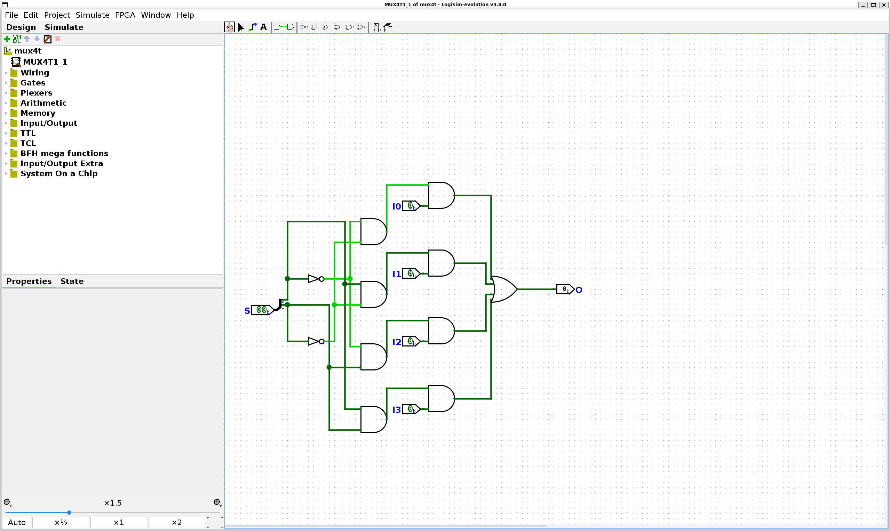

# Lab1 技术报告
## 1. 实验目的
- 对整个开发框架要做什么有更深的了解，从硬件原理到驱动程序的写法，到更多电路的logisim或者verilog实现。
- 通过工程文件对FPGA开发过程中的硬件软件联动（比如SW与数码管显示）有更多了解。
- 对verilog语法与一些新的写法进一步了解。
## 2. 实验过程
### 2.1. Lab1-1 实验过程
- 首先是在`logisim`中画好4路选择器的电路图，注意这一过程中需要调节一些参数。

- 在这一过程中应该注意到在Design界面中能够选择更多仪器，比如说这里的**Splitter**。同时，在进入edit模式之后，可以选择具体的元器件到Properties界面进行输入的**位宽度编辑，输入输出数量编辑**等等。

- 随后在导入了相关文件就可以开始编写**八路选择器的代码**。
- 与C语言中相似，很多功能都可以封装到一个`module`里面来实现，比如说在我的代码中就将二路选择器做到了一个`module`之中。
```verilog
module Mux2T1_1(
   input [1:0] I,
   input S,
   output O
);

assign O = S ? I[1] : I[0];

endmodule

module Mux8T1_1( 
   input [7:0] I,
   input [2:0] S,
   output O 
);

wire [1:0] median;

Mux4T1_1 mux4_low(I[0], I[1], I[2], I[3], median[0], {S[1], S[0]});
Mux4T1_1 mux4_high(I[4], I[5], I[6], I[7], median[1], {S[1], S[0]});
Mux2T1_1 mux2_final(median, S[2], O);
   
endmodule
```
- 在这里有一些值得注意的小点，首先是在线束当中，索引就是这里的值对应的二进制编码的权重。例如如果`S[1:0]=2'b01`，那么`S[1]=0,S[0]=1`。这也是我们在调用Mux4T1_1的时候将S[1], S[0]倒过来的原因。**脑子里面一定要很清楚**,每个值对应的都是什么，**尤其是在设计输入输出的阶段**
- `{}`可以将多个原本的single-bit信号组合成一个multi-bit组合信号。
- 仿真verilog实现：(省略一部分，仅作思路展示)
```verilog
...
    initial begin
        S = 3'b000; I = 8'b00000000;
        #5;
        S = 3'b000; I = 8'b00000001;
        #5;
        S = 3'b001; I = 8'b00000000;
        #5;
        S = 3'b001; I = 8'b00000010;
        #5;
...
end
```
- 注意要遍历完全部的情况。我在这里对S采用二进制递增进行遍历，I则是触发对应信号，在S未选择的点位为1的时候进行一次测试即可。

- 这里是用`verilator`进行仿真的结果，可以看到不同时间下不同输入所对应的不同输出。
- 确认仿真结果正确之后，补全top.v，注意在top.v中如果想要使用多输入可以采用切片，但是注意与定义的时候相同，**大的数字应该在前面。(同样用权重的方式进行理解)** 这一点在例程中可以得到体现。
```verilog
module top(
  input [7+3:0] SW,
  output LD0
);

Mux8T1_1 Mux8T1_1_instance(
  .I(SW[7:0]),
  .S(SW[10:8]),
  .O(LD0)
);
```
- 随后对引脚约束文件`nexysa7.xdc`进行编写，这里注意必须要根据开关编号选择**对应的引脚编号**。

- 在这些步骤都结束之后，就可以将文件导入Vivado进行硬件验证。
- 经由验证，发现结果是正确的，用SW10-SW8作为S信号，用SW7-SW0作为I信号，信号输出符合要求。

### 2.2. Lab1-2 实验过程
#### 译码器实现
- 首先是在`SegDecoder.v`文件中把译码器所对应的代码实现。这里有几个需要注意的点：第一个是LE，也就是**使能信号**。这里可以认为是一个单位的掩码，如果LE为1也就是不使能，那么所有的数码管都不可能亮起，也就达到了使能信号的目的。
- 随后在Verilator当中对波形进行验证，发现仿真结果符合要求。

#### 四选一多路选择器实现
- 实现了译码器后，开始实现32位复合四选一多路选择器。在这里我采用了**多个一位多路选择器组合**来实现。这一元器件被使用的原因是要通过**同一个选择信号**来输出**一整组**的数据，而不是原先的single-bit数据。
- 先将在lab1-1中通过logisim生成的Mux4T1-1.v导入到lab1-2的文件夹中，从而可以使用Mux4T1_1来实现Mux4T1_32.v中的功能。**要注意数字的高位与低位分别在哪里，每个输入的数据width与输入输出顺序**
```verilog
Mux4T1_1(I0[0], I1[0], I2[0], I3[0], O[0], S);
Mux4T1_1(I0[1], I1[1], I2[1], I3[1], O[1], S);
Mux4T1_1(I0[2], I1[2], I2[2], I3[2], O[2], S);
Mux4T1_1(I0[3], I1[3], I2[3], I3[3], O[3], S);
...
```
- 仅作演示，数字延伸向下直到31.
- 这里我采用的**多个一位多路选择器组合**这种方法的优势是实现简单且原理易于理解。但是缺点在于需要显式地写出每一个bit所对应的表达式。更多讨论将会在**思考题**部分进一步进行。
#### 下板验证：
- 在导入了全部需要的文件之后，我们可以在Vivado上进行Synthesis与Implementation，可以看见这些步骤都顺利完成了。

- 下一步就是进行下板验证，Generate Bitstream之后下载到Nexys A7开发板上拨动SW0-1可以观察到不同位数被显示出来，拨动SW2发现可以控制整体的亮灭。


## 3. 实验结果
### 3.1. Lab1-1实验结果
- 在Vivado上进行仿真，通过testbench.v查看波形图，发现结果是正确的。

- 这是在Vivado上验证得到的结果，发现能够实现实验所要求的结果。
- 注意这里可以在仿真的时候右键**多位**数据**更改radix属性为binary**，要不然十进制看起来不是很直观。
- 随后进行下板验证，依次改变不同的**SW[7:0]输入信号**与**SW[10:8]选择信号**，验证得到全部的结果都是正确的，符合电路设计的要求。

### 3.2. Lab1-2实验结果
- 首先在Verilator中对SegDecoder的真值表进行验证，发现符合我们的Common Anode设计下的要求。

- 然后生成bitstream下载到Nexys-A7开发板上，拨动SW0-1发现显示的**位数区间**变化，拨动SW2发现可以控制整体的亮灭，可以实现预期中的功能。

## 4. 思考题
### 4.1. Lab1-1 思考题
#### 4.1.1. Mux2T1_1的组成
- 首先使用**Decoder**将输入信号S分别直接输出为OUT1与取反之后输出为OUT0。这样的过程将信号S变成了**实际的控制信号**，这样的过程就可以被称为是"Decode"
- 随后使用表达式`O = (OUT0 ∧ I0) ∨ (OUT1 ∧ I1)`来进行选择。假如OUT0为1，也就是S为0，那么仅有左侧的信号起到了实际控制的作用。相反则是右侧的信号起到了决定输出的作用。所以这里就实现了**二路选择器**的实际功能。
#### 4.1.2. Mux4T1_1的组成
- 四路选择器的原理其实与Mux2T1_1是相同的。如果我们不采用多个二路选择器来构建，那么同样是**需要先构建一个解码器**，这个解码器应该要能够实现每次都仅有一条支路被激活，而且这条被激活的支路对应的信号编号与要求相同。
- 随后在被激活支路当中，因为是与门且另一个信号为1，所以具体的输出由IN来决定，后面再输入给四输入与门就能够实现四输入解码器的功能。
#### 4.1.3. Mux8T1_1的组成
- 这里有两种实现的思路，第一种是与前面相同，仅需要设计8输入对应的解码器，后面的部件是相同的，只有输入规模上有所变化。
- 第二种实现的思路也就是我在代码中使用的思路，那就是**递归**解决选择的问题。需要两个四路选择器与一个二路选择器。二路选择器负责**最高位**，从而选择是从下面的**哪一个四路选择器**中输出。
#### 4.1.4. Mux2^nT1_1的组成
- 第一种同样使用先解码再选择输入的方法。但是这里的解码器设计会变得越来越复杂，可能会导致开销很大。
- 第二种采用**递归**的思路。也就是如果想要组成2^n规模的多路选择器，那么就只要先找到2^n-1路选择器与2路选择器就可以了。其中2路选择器负责**接受最高位信号**并选择是高2^n-1位的选择器作为输出还是低位的作为输出。
### 4.2. Lab1-2 思考题
#### 4.2.1. for语句理解
- 如果要把这里的for语句拆开，那么以第一个for循环举例：
```verilog
for(i=0;i<8;i=i+1)begin
data=i[3:0];
#5;
```
展开之后变成：
```verilog
data = 4'b0000;
#5;
data = 4'b0001;
#5;
...
```
- 与C语言当中非常类似，for()中分别是循环起始条件，结束条件以及迭代表达式，但是需要begin与end来分隔开始与结束部分。同时内部有一个延时模块，这样就可以在simulation中观察到一段时间内的稳定信号。
#### 4.2.2. 多路选择器写法比较
- 多个一位多路选择器组合是最简单的实现方法，而且易于理解，所以这也是我在实现中选择了这一种写法的原因。
- 与或形式同样是进行每一位的赋值，但是这里并没有调用一位的多路选择器，而是直接使用逻辑表达式来进行，缺点是需要进行化简工作。
- 采用行为描述法，三目运算符直接进行**多位**的输出，就不用先把输入拆成多位再按位赋值。这种方法写法最为简单，但是远离硬件的具体实现。
- index索引语法：将输入的**向量**组成一个**存储向量的数组**，再通过S的自动解码**直接访问数组中的对应元素。**
- if-else写法：同样是更为高级的写法，但是远离电路的具体实现。
- case写法：更加简单，而且同样可以实现多位的同时输入输出
- 最喜欢的写法：index索引语法。原因：能够直接解码S作为向量数组的索引，而且不需要将多位的输入转化为每一个位的独立信号，速度快的同时也非常直观
#### 4.2.3. 关于文件细节的解读
##### 有关tcl文件的解读：
- 在代码中设置了各种目录变量，比如说这里就设置了**源文件**，**综合文件**与**包含文件**的路径。
```tcl
set SRC_DIR   $env(DIR_SRC)
set SYN_DIR   $env(DIR_SYN)
set INCLUDE_DIR   $env(DIR_INCLUDE)
```
- 这里还会有对约束文件的引用：
```tcl
read_verilog [glob [file join $SRC_DIR *.v]]
read_verilog [glob [file join $SYN_DIR *.v]]
read_verilog [glob [file join $INCLUDE_DIR *.vh]]
read_xdc [glob [file join $SYN_DIR *.xdc]]
```
- 最后就会生成一个bitstream文件。这个脚本的目的就是达到自动化Vivado项目的各个步骤，取代了在GUI中的逐步操作。
##### 有关clk_div的作用：
```verilog
module ClkDiv(
    input clk,
    input rstn,
    output reg [31:0] clk_div
);

    always@(posedge clk)begin
        if(~rstn)clk_div<=32'b0;
        else clk_div<=clk_div+32'b1;
    end

endmodule
```
- `input clk`输入时钟信号，模块ClkDiv中的全部动作都以这一信号**作为触发时钟**
- 这一模块实现了32位的计数器，当不在复位状态的时候，**计数器在每一个时钟信号跳变高电平**的时候加一，index寄存器递增一。
##### 有关index寄存器的作用：
```
...
    reg [2:0] index;
    always@(posedge clk)begin
        if(~rstn) index<=3'b0;
        else index<=index+3'b1;
    end
...
```
- 每个时钟高电平的时候，index会递增
- 用于**动态扫描8位显示器中的每一位**， 每一个index都对应一个数字位。
##### 通过SW来选择显示的位数
- 我们在top.v中查看，可以找到如下代码：
```verilog
...
  Mux4T1_32 mux(
    .I0(display[31:0]),
    .I1(display[63:32]),
    .I2(display[95:64]),
    .I3(display[127:96]),
    .S(sw[1:0]),
    .O(data)
  );
...
```
- 可以看到这里实际上完成了一个**字符串常量切片**的操作，通过FPGA上的SW信号作为Selection Signal,从而选择出一个32bit的数据片段，也就是在Nexys-A7开发板上显示的位数。
- 注意到这里的切片方式是`[MSB:LSB]`，举例来说`[31:0]`访问到的就是权重最小的32位
## 5. 心得体会
- 用verilog解决同一个问题往往有非常多样的解决方案，每一种方案都有优劣之分。
- 我感觉verilog学习与C语言非常类似。刚开始学习C语言的过程中我们会更频繁地自己实现一个数据结构，更加直接地操作计算机内存，在熟悉了C语言与内存之间的关系之后就可以转向使用C++中的STL等等以提高开发效率。而Verilog学习当中，刚开始我们可以更多使用数据流描述法，后面在熟悉了软件与硬件之间的关系之后就可以使用一些高级的功能，可以优化我们的开发效率。