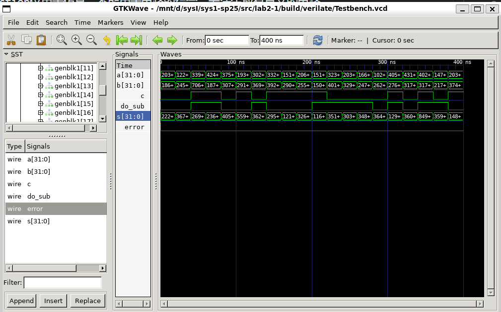
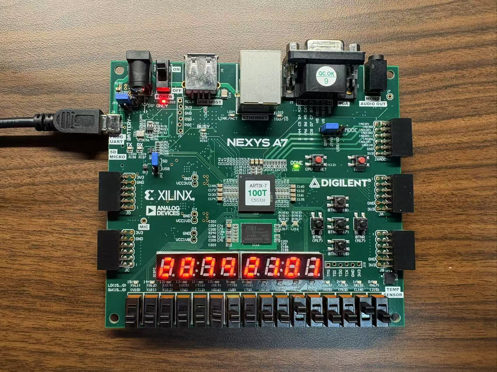

# Lab2-1 实验报告

## 1. 实验目的

## 2. 实验过程
### 2.1 电路设计
#### 2.1.1 一位加法器
- 首先对1-bit的加法器进行设计。注意这里可以使用*多元素之间异或运算*的性质，也就是在有奇数个一的时候会输出1，而在有偶数个一的时候会输出0。这个性质可以用于S信号的产生，而c_out的产生就进行有两项为1的情况遍历即可。
#### 2.1.2 指定位数加法器
- 随后对Adders进行设计，注意这里有parameter对输出位数的指定。
- 在`genvar`的使用中，我注意到`genvar`类型的变量必须是在**generate块外部声明**，而且作用范围仅限使用到变量的`generate`语句当中，而且可以在多个`generate`块中使用同一个`genvar`变量，但是请注意这一变量在编译时必须是确定的，而且在编译结束之后**生命周期就已经结束**。
- 务必要注意在向量的定义过程中前面的数字是最高位的**索引**，而不是这一整个向量的**规模**。
- 同样是进行值的分配与逻辑运算，**.a(x)与assign语句的区别是什么？**
    - `.a(x)`语句是在**使用模块**的时候用于端口连接的。可以将这个.认为是一种导线到端口的连接方式，a是端口,x是导线。
    - assign是用于描述**组合逻辑的**，定义了信号之间的逻辑关系。
- 注意C线组的规模与a,b的线组规模是不一样大的。因为输出还有更高一位的carry，所以c的规模会比a, b大一。
#### 2.1.3 指定位数加减法器
- 这里会需要生成一个N位全为c的掩码来分别进行加法与减法运算，我选择采用新建一个向量并通过generate for语句进行循环赋值的方式来生成。
- 我们在add_subers中调用adders的时候会出现**同名的引脚变量名**，但是放心，这并不会冲突。因为这两者所代表的意义并不相通，仅在各自的模块中有效。
- 不要被搞晕了，**括号前的是被调用模组的引脚**，而**括号中的是当前全局模组的引脚。**
- 我们在add_subers模块中调用adders的时候需要显式地声明参数，因为如果不声明那么将会使用默认的位宽度。所以**在模块内调用其他模块**时一定要注意，**显示声明参数。**
- localparam并不是电路的一部分，所以不能使用电路的输出赋值，而且不能够被赋值两次。
```verilog
    Adders #(.LENGTH(LENGTH)) adders(.a(a), .b(median), .c(do_sub), .s(s), .c(c));
```
### 2.2 仿真测试
#### 2.2.1 仿真文件编写
- function中返回的值就是**函数名同名变量**，注意函数中的变量使用reg的意思并不是实际上有一个寄存器，因为function不是电路，没有导线。
- function仅用于仿真，不能用于电路的综合，无法生成有意义的电路。
- initial块中的for语句与generate块中的for语句不同，使用的是`integer`变量而不是`genvar`，`generate`的for语句是是用于电路描述的，而`initial`的`for`语句用于仿真激励。这是因为`generate`块就是用于**在编译阶段生成硬件逻辑**，而`initial`块则是用来**初始化仿真验证的。**
- 在`testbench.v`中各个部分实际上是**并行运行**的，这与实际硬件电路是非常类似的。并不是前面的for语句执行结束才能进行下一步，而是for语句在更新各种变量的同时，示例add_sub也在**同时进行运算**，而下面则是在时钟上升沿对结果进行一次**错误验证**。
```verilog
    integer i;
    initial begin
        for (i = 0; i < 20; i = i + 1)begin
            a = $random;
            b = $random;
            do_sub = $random[0];
            #20;
        end
        $finish;
    end
```
- 在代码中使用了for语句来进行a, b的随机选择，采用随机数的LSB来进行加减法两种情况下的验证。
- 
#### 2.2.2 仿真验证
- make wave后检查波形图，发现error信号始终为0，也就是说我们的加减法器模块正在正确运行。


### 2.3 下板验证
- 经过下板验证后，通过拨动各个开关，发现结果是正确的。



## 3. 实验结果

## 4. 思考题

## 5. 心得体会