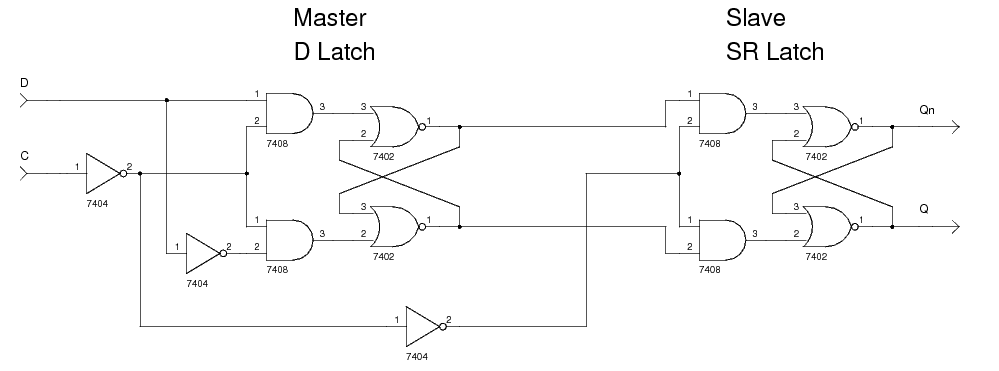

# lec5-1
- Combinational Logic Circuit: 组合电路，**current input is sufficient for output**
- Sequential Logic Circuit: 时序电路，与前一时间的状态有关->Storage Element
- Digital Logic Circuit->*Black Box*
## Combinational Logic Circuit
### Requirements
- 节点只能有一个输出（不能有两个门的输出到同一节点）
- Loop Not allowed ***(Latch)*** 
- **no output->input**: Sequential
### 2-level vs. multi-level
- 2-level: SOP, POS -> Minimize Gate Delay but fan-in
- fan-in 对器件设计要求较高
- Trade-off between cost and speed
### Design
- Logic Functions-> Algebraic Calculation or K-map
- Timing Analysis-> 时序分析，确定正确性
- High-Impedence-> 当一条支路的输入不需要被考虑的时候可以被设置为high-z状态，阻抗高
	- 使用Three-State Gate进行实现，如果使能信号为0则为高阻抗状态，如果为1则传输I信号
## Basic Designs
### Encoder/Decoder
#### Decoder
- 使用二进制n-bit输入，输出为$2^n$路的输出，**仅有对应的解码值电路**为1,其他均为0。
- e.g. $input \; = \; b01$对应$D_1 = 1, D_n(n!=1) = 0$ 
- 一张k-map针对**一路输出**
- 多位的Decoder一般不直接使用基础门实现，而是使用更小规模的Decoder进行实现
- 更小规模的Decoder的输出分为两路，多出来的input bit可以作为一个one-bit decoder，这两个组合形成更多位的Decoder
- 所以每一个n-bit decoder都可以**递归由(n-1)-bit decoder与1-bit decoder**组成，最后一层使用$2^n$个与门。
- Scalable Feature 用**线性增加**的成本解决**指数增加**的问题->较好的扩展性
#### Decoder with Enable Signal
- 在Decoder的最后一层再加上一层与门，加入EN信号，fan-out到最后一层与门的**一路输入**->如果为1才能有效输出结果
- 也被称为Demultiplexer
#### Decoder -> Binary All-Adder
- 每一个Decoder对应的输出路再映射到输出的结果,采用SOP（多输入或门，输入为Decoder的对应路输出）进行映射
#### SegDecoder
- 可以针对**每一个**数码管进行K-Map求真值表达式
- 也可以和上面一样，先使用解码器，再用解码器的输出给到对应的**一组数码管电平参数**
#### Encoder
- $2^n\; input -> n\; output$ 
- 采用或门实现，K-map
- 采用更小的数据bit进行输出，减少sparse情况下的浪费
### All-Adder & Half Adder
- 半加器：没有上一位的进位Z
- 全加器：有上一位的进位Z
# lec5-2
## Basic Designs of Combinational Circuit
### Priority Encoder
- 最高位为1的时候直接输出一个特定的编码，此时**其他位的输入**都无所谓了
- 比如说输入是$D_3, D_2, D_1, D_0$，那么拥有最高优先级的$D_3$为一的时候，输出就可以被确定，而不用考虑更低位数的其他输入。
### Multiplexer
- n选1
- 标准的cmos电路必须要是pMOS与nMOS结合的结构
- three-state gate三态门用的并不是传统CMOS结构
- 多路选择器也可以选择多位的信号，用电路上画一斜再标一个n来表示
### Demultiplexer
- 根据选择信号将输入电路上的信号传输到**对应的一条输出上**
### Half-Adder
- 两个输入，输出一个当前位结果F(sum bit)（通过异或实现）与进位结果C
### Half-Adder
- 三路输入，相较于Half-Adder还加上了前一位的进位
- Scalable，可以使用两个Half-Adder进行实现
## Timing Analysis
- Circuit Delay->经过的逻辑门越多则延迟越严重
- $t_{pHL}$的意思就是从高电平到低电平的时间，$t_{pLH}$就是从低电平到高电平的时间
- $t_{pd}$就是从input到output的最大延迟时间,**Propagation Delay**
- $t_{cd}$就是从input到output的最小延迟时间，**Contamination Delay**
- Critical Path（关键路径）就是经过逻辑门最多的路径
- Race Hazard 不同通路传输速度不同可能会导致**输出中的不正常现象**，也就是glitch，电路中的小脉冲
## Sequential Circuits
### Intro
- Combinational Logic + Storage Element
- Bistable Circuits
- Level-Triggered：电平触发（电平保持触发也保持），每一个时刻的信号都在起作用
- Edge-Triggered：只有在**碰到上升沿的时候**才会对信号进行**改变**，只有信号上升的部分才起作用
- Synchronous: 在特定的时间才会变化，也就是discrete instants下才会发生变化
- Asynchronous: 在任意的时间都可以发生变化
### Basic Designs
#### Bistable Circuit 
- 两个反相器连在一起，属于latch电路，可以保持稳态可以同时输出$\bar{Q}与Q$
- 不能有输入信号
#### RS-Latch
- 使用**或非门**，1为触发信号
- Reset信号与Set信号
- RS触发器，R = 0, S = 0则保持前一个状态，即$Q = Q_{prev}$ 
- R = 1则$Q = 0, \; \bar{Q} = 1$
- S = 1则$Q = 1,\; \bar{Q} = 0$
- S = 1, R = 1则两路输出均为0（$Invalid \; State$）
- 也有$\bar{R}\bar{S}-Latch$, 0为触发信号，使用**与非门**进行触发
- 状态变化的时候才会耗费能源
- Level-Triggered
#### RS Latch with Control Input
- 可以在两路输入之前再加一层，使用C信号来决定输入能不能够被传输进入
- C可以由时钟信号来控制。
- C = 1的时候始终接受新的信号，C = 0的时候保持上一个状态
### D-Latch
- Data分拆为两路，一路取反，就变成了RS触发器中的两路输入
- D = 1 Set, D=0->Reset
### Latch-Timing problem
- CLK信号作为C信号，$\bar{(Q)}$ 接回D，这样会造成在一个CLK周期内电平多次跳变。
#### Pulse-Triggered flip-flop
- 与普通的DCQ相比，是需要出现一次额**完整的脉冲**才能实现输入到输出的回路
- 主从触发器，高电平**触发第一个**，低电平**触发第二个** 
- 前后的C信号相反
- C = 1的时候主触发器受控制，C = 0的时候从触发器受控制
- 使用脉冲信号控制了输出的结果
- 如果输入D信号有glitch而恰好此时Master D-Latch处于有效状态，那glitch会被捕捉
- RS为**invalid state的时候可能会导致意外的结果**
### Edge-triggering D Flip-Flop
- 不采用独立的R,S信号而采用合并的D信号（$D \; and \; \bar  {D}$）

- 保证SR的合法性
- 有**上升沿**与**下降沿**触发，C信号取反即可
- 在edge signal满足的时候进行触发，Slave的Q信号就是D信号
- D信号中的glitch不会影响信号的触发，因为只有edge处才会进行触发
- Level-Triggered D Latch（传统D-Latch， 高电平触发）的CLK信号不用标小三角形，而Edge-Triggered D Latch的CLK信号要标小三角形。
- Latch锁存器（一个触发器） Flip-Flop寄存器（两个触发器）
- 