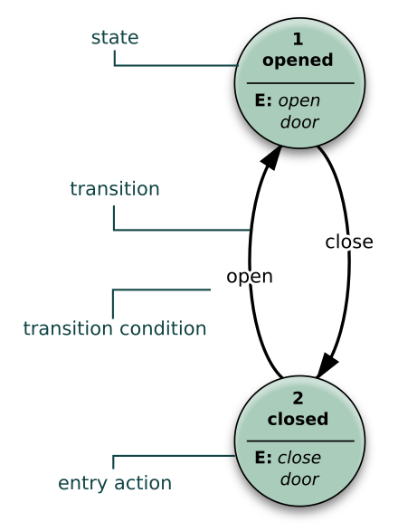

# lec6-1
## Basic Sequential Circuits
### Dominating Signal
- 触发信号，比如说或门中的1信号，与门中的0信号。
### more Flip-Flops
- JK Flip-Flop
- T Flip-Flop Avoiding 1s Catching(Glitch)
## Terminology
### Finite State Machine
- 有限状态机，可以使用state diagram或者state table来描述
#### Representations
##### Diagram Representation
- 用圆圈代表states，箭头代表states之间的转换，**不允许切换就不存在箭头**
- 
- 在描述电路的FSM Diagram中，transition上的数字就是transition**所需的输入信号**与**产生的输出信号**
##### State Table Representation
- 使用一张表，阐释在每一个Current State下采取不一样的Input达到的Next State与输出
- ![[img4.png]]
- 可将当前状态当做是输入
### Basic Analysis Procedure
- 每个信号都写成t的函数，如果是表达同一个信号的位置转化那就是t+1与t的函数之间的关系
- 如果是当前时刻的输出，则使用相同的时间进行输出即可
- 列出对应的State Table
- 使用state diagram代表transition关系
## Use Graphs to simplify
### Equivalent State
- 如果两个状态对**所有可能的输入信号**的反馈都是完全相同的，那么可以认为这两个状态是**Equivalent** 的。（响应就是状态的本质）
- 检查**输入**，**输出**与**状态切换**，就可以判断两个状态是否等效（同一个输入下的output与destination states相同）
### Moore Model & Mealy Model
#### Moore Model
- Input先改变状态，使用状态进行输出（输出只跟状态相关）
#### Mealy Model
- Input与State同时会影响output，到达一个新的state
#### Examples
- Moore图形上，arc上只用输入，不需要output，而state上就可以标明对应的output **(output由next state决定)**
- Mealy Model 图形上，arc上需要标明输入与输出，而state上不需要标明对应的output
- Moore图形往往需要定义更多的state
- 